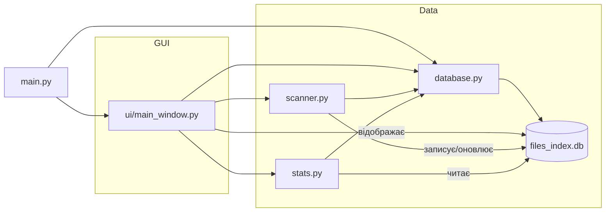

# Архітектурна схема системи

Цей файл описує архітектуру застосунку "File Indexer Pro".

## Основні компоненти

- `main.py` — точка входу. Ініціалізує базу даних і запускає графічний інтерфейс.
- `database.py` — робота з SQLite: створення таблиці, переміщення у кошик, відновлення, очищення.
- `scanner.py` — сканування файлової системи, обчислення хешів файлів та оновлення таблиці `files`.
- `stats.py` — запити до бази для статистики: кількість файлів, дублікати, топ розширень, топ директорій.
- `ui/main_window.py` — інтерфейс PyQt5: кнопки, фільтри, таблиця файлів, прогрес-бар, менеджер кошика.

## Структура даних

- SQLite таблиця `files` з полями:
  - `id` — первинний ключ
  - `path` — унікальний абсолютний шлях файлу
  - `name` — назва файлу
  - `extension` — розширення
  - `size` — розмір у байтах
  - `m_time` — час останньої зміни
  - `hash` — MD5 хеш вмісту файлу
  - `original_path` — оригінальний шлях для видалених файлів
  - `deleted` — прапорець видалення
  - `deleted_at` — час видалення

## Архітектурна схема (Mermaid)

## Опис взаємодій

1. `main.py` викликає `database.init_db()` та `run_gui()`.
2. `ui/main_window.py` створює графічний інтерфейс для користувача.
3. При натисненні на "Сканувати папку" запускається `scanner.scan_to_db()`, який:
   - обходить файлову систему;
   - для кожного файлу обчислює MD5 хеш;
   - записує атрибути файлу до таблиці `files`.
4. `stats.py` формує статистичні запити до `files_index.db` для відображення аналітики.
5. `database.py` управляє кошиком, відновленням та фізичними операціями з файлами.

## Висновок

Система побудована за архітектурою з розділенням на:
- UI шар (`ui/main_window.py`),
- логіку сканування (`scanner.py`),
- шар доступу до даних (`database.py`),
- аналітичний шар (`stats.py`).

Це дозволяє легко додавати нові функції, наприклад теги, мульти-користувачів або додаткові зведені таблиці.
